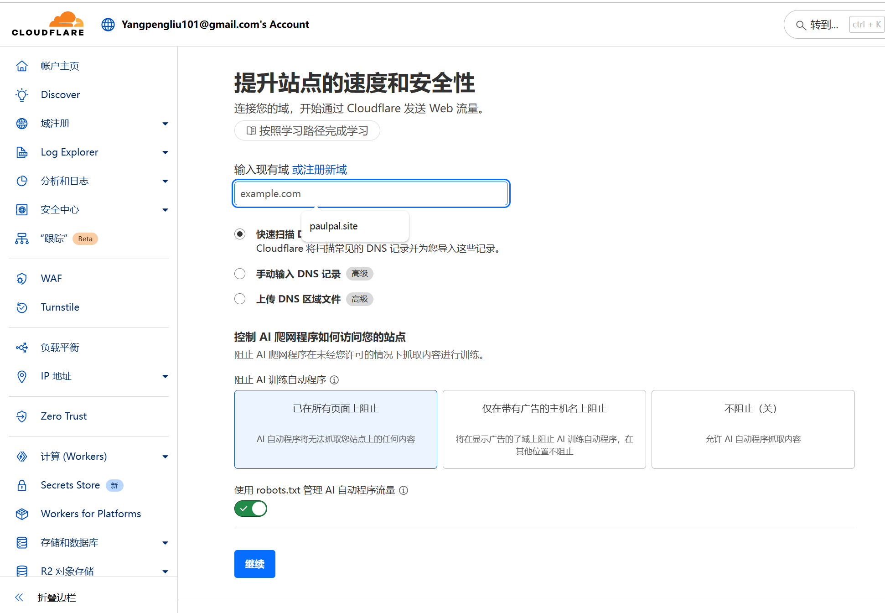
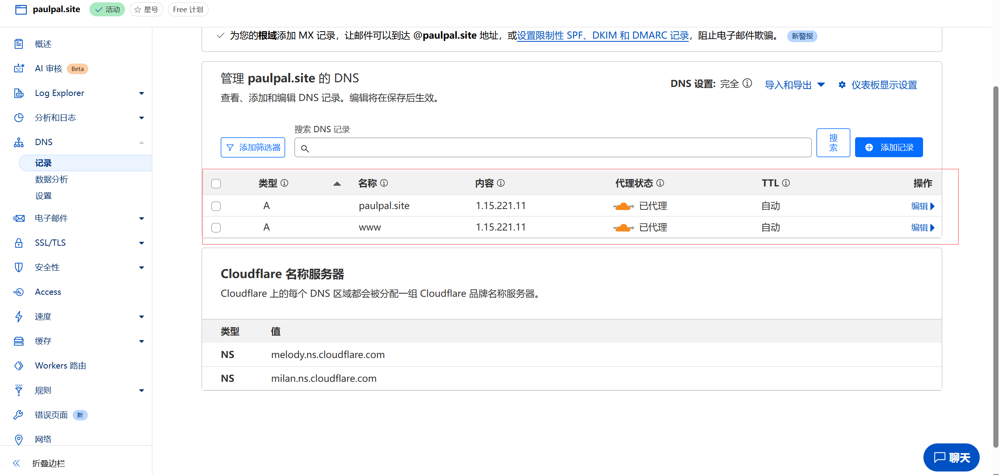
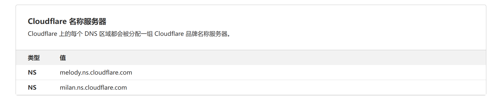
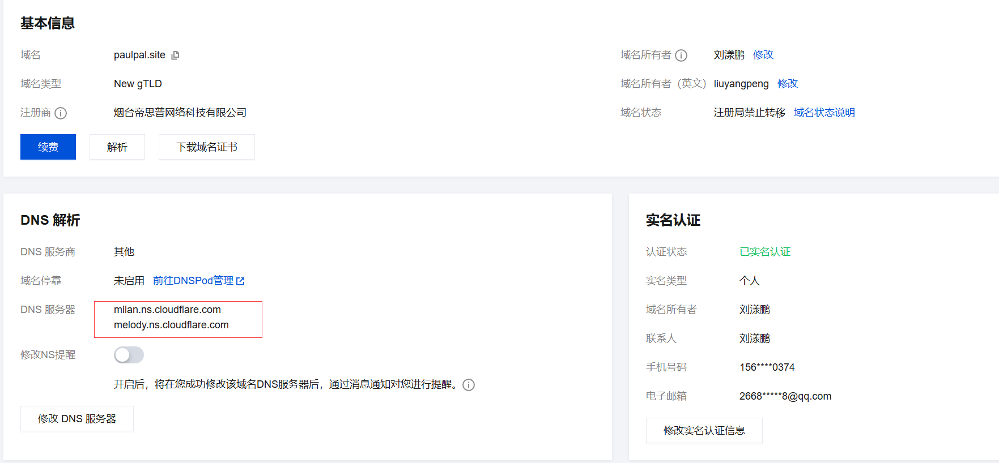
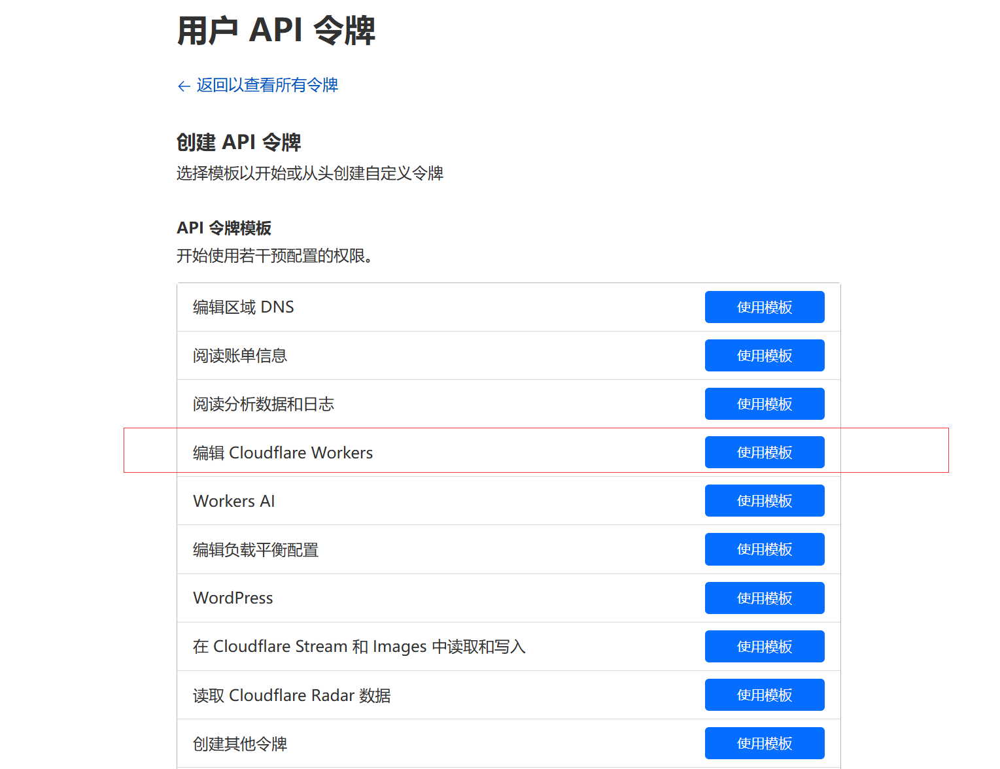

# ESR 基本配置

## 访问 Cloudflare 管理主页

点击你需要管理解析的有效域名，进入该域名的管理界面。

点击 DNS 菜单，进入域名解析管理。

## 在 Cloudflare 管理域名解析

在 CloudflareDNS 记录页面中，点击添加记录按钮

类型为 A 代表通过 IP 地址解析；

名称为@代表解析到主域名（如果你想解析到 www 开头的域名，将@换成 www 即可）；

输入 IP 地址，代理状态默认开启，然后点击保存按钮。

一条新的 A 记录添加成功，你可以通过点击对应记录的编辑按钮对解析记录进行修改编辑操作。



## 名称 DNS 服务器

Cloudflare 会提供一组名称 DNS 服务器，需要将这组名称服务器配置到自己的域名提供商的 DNS 配置里




## wrangler 配置

ESR 中的核心 Worker 可依托于 Cloudflare 官方提供的@cloudflare/wrangler 去实现，具体可参考官方文档
简要说下相关配置，根目录下需要有一个 wrangler.toml 文件，配置参考如下，核心的两个配置一个是 account_id(Cloudflare 域名管理里查看)，一个是 entry-point 和 watch_dir 入口文件相关的配置

```
name = "esr-worker"
workers_dev = true
type = "javascript"
compatibility_date = "2021-10-31"
account_id=""

[site]
bucket = "dist/client"
entry-point = "."

[build]
command = "npm run build"
watch_dir = "dist/worker"

[build.upload]
format = "service-worker"
```

在修改完配置文件后，需要进行 wrangler config 和在修改完配置文件后，需要进行 wrangler login 操作，按提示操作即可
核心是配置用户的 API 令牌


## 核心代码参考

.png>)
.png>)
.png>)
